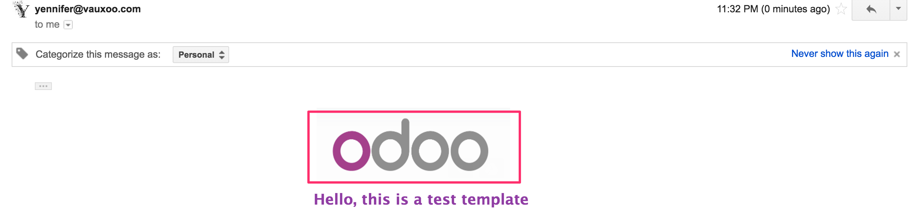

.. image:: https://img.shields.io/badge/licence-AGPL--3-blue.svg
    :alt: License: AGPL-3

=========================
Attach Image Email
=========================

This application allows you to attach an image in the email from base64 code.

Requirements
------------

You need add in email template the image base64 code, as follow:

````

Result
------

An email with the image attach:




Contributors
------------
* Ivan Yelizariev <@yelizariev>
* Moises López <moylop260@vauxoo.com>
* Yennifer Santiago <yennifer@vauxoo.com>
* Vauxoo <info@vauxoo.com>

Maintainer
----------

.. image:: https://www.vauxoo.com/logo.png
   :alt: Vauxoo
   :target: https://vauxoo.com

This module is maintained by Vauxoo.

A latinamerican company that provides training, coaching,
development and implementation of enterprise management
sytems and bases its entire operation strategy in the use
of Open Source Software and its main product is odoo.

To contribute to this module, please visit http://www.vauxoo.com.

